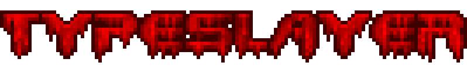

<p align="center">
  
</p>

<p align="center">
  a tool for diagnosing and fixing TypeScript performance problems</br>the nice thing is, you can't hide from TypeSlayer (even if you <code>//@ts-ignore</code> or <code>//@ts-expect-error</code>)
</p>

## Quickstart

run:

```bash
npx typeslayer
```

in the root package you want to inspect (i.e. colocated to your package.json). The tool will:

1. start a local web UI,
2. run TypeScript tooling to produce traces and CPU profiles
3. provide interactive visualizations (treemaps, force graphs, speedscope/perfetto views) that you can use to identify problems

## Frequently Asked Questions

- ["but I just want to see my code"](./FAQ.md#but-i-just-want-to-see-my-code)
- [why do I see lots of `<anonymous>` everywhere?](./FAQ.md#why-do-i-see-lots-of-anonymous-everywhere)
- [what about `tsgo`?](./FAQ.md#what-about-tsgo)
- [what about `Svelte` or `Vue`?](./FAQ.md#what-about-svelte-or-vue)
- [where does TypeSlayer store my data?](./FAQ.md#where-does-typeslayer-store-my-data)
- [how sensitive is the data in the outputs?](./FAQ.md#how-sensitive-is-the-data-in-the-outputs)
- [does TypeSlayer track me?](./FAQ.md#does-typeslayer-track-me)
- [why does the Type Graph keep moving?](./FAQ.md#why-does-the-type-graph-keep-moving)
- [how is testing a library different?](./FAQ.md#how-is-testing-a-library-different)
- [this is a lot. where do I start?](./FAQ.md#this-is-a-lot-where-do-i-start)
  - [1. is there _actually_ a problem?](./FAQ.md#1-is-there-actually-a-problem)
  - [2. is there an outlier in the Treemap?](./FAQ.md#2-is-there-an-outlier-in-the-treemap)
  - [3. does anything look weird in Perfetto?](./FAQ.md#3-does-anything-look-weird-in-perfetto)
  - [4. are there any Award Winners that stand out?](./FAQ.md#4-are-there-any-award-winners-that-stand-out)
  - [5. sometimes, you still gotta RTFM](./FAQ.md#5-sometimes-you-still-gotta-rtfm)
- [can I pay you to help me? 💸](./FAQ.md#can-i-pay-you-to-help-me-)
- [but I refuse to run postinstall scripts..](./FAQ.md#but-i-refuse-to-run-postinstall-scripts)
- [why isn't this a CLI tool?](./FAQ.md#why-isnt-this-a-cli-tool)
- [how do I use this with a monorepo?](./FAQ.md#how-do-i-use-this-with-a-monorepo)
- [what if I already have trace files?](./FAQ.md#what-if-i-already-have-trace-files)
- [who needs this stupid thing, anyway?](./FAQ.md#who-needs-this-stupid-thing-anyway)
- [what if it's been going for a long time?](./FAQ.md#what-if-its-been-going-for-a-long-time)

## Support

TypeSlayer supports Linux x64 (glibc 2.39+), macOS ARM64 (Apple Silicon), and Windows x64.  Please note that next year is the year of the Linux desktop 📯.

## Contributing

1. all commits (and therefor PR merges) must be the next bar from ~~"My Name Is" (complete)~~ "The Real Slim Shady" by Eminem, until further notice
2. no further requirements

## Thank You

this app is built with Tauri, TanStack, Vite, Biome, React, MUI, Rust, and of course, TypeScript.
